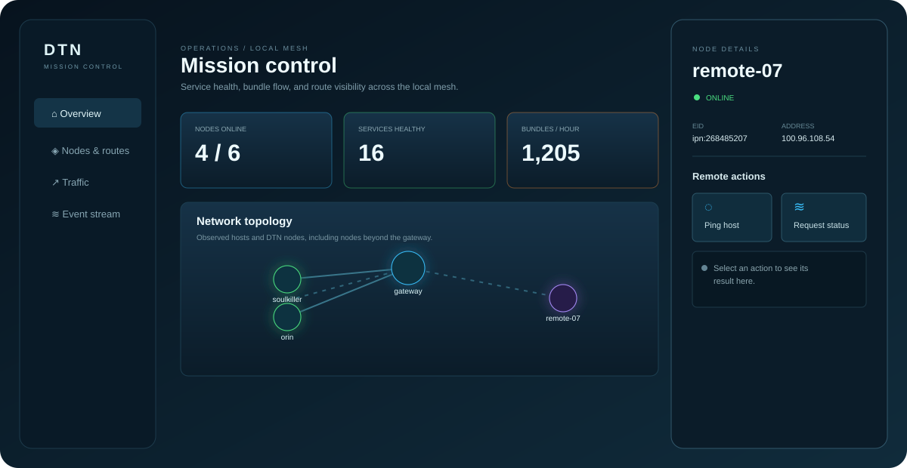

# DTN Mission Control

> **WIP — early operational prototype.** Interfaces, telemetry, and remote actions are still changing.

DTN Mission Control is a small, zero-dependency dashboard for observing ION/DTNEX testbeds. It presents local hosts, gateway-advertised nodes beyond the gateway, process health, bundle throughput, bundle-purpose groups, and node-level interaction controls.



## Run locally

```bash
python3 server.py
# http://127.0.0.1:8088
```

The dashboard can also be opened as a static `index.html`. `state.json` is an intentionally small placeholder; a collector or authenticated gateway should replace it atomically with live state.

## What is included

- Topology for local edge nodes, the gateway, and remote nodes beyond the gateway.
- Process-level health for `bpclock`, `ipnfw`, `udpclo`, `cfdpclock`, `bputa`, and `dtnex`.
- Bundle-purpose groups: Administrative, Keepalive, Echo/probe, Retry/custody, CPB metadata, and Application payload.
- Clickable node detail drawer with service health and safe interaction controls.
- Non-invasive LAN neighbor discovery through `/api/discovery`.
- `/api/action` seam for authenticated node agents; only ICMP host probing is implemented by default.

## WIP boundaries

This is not yet a production monitoring system. The visual state is mock data until a signed collector is connected. DTN echo, status, and route actions intentionally refuse to send traffic unless an authenticated node agent is configured. Do not infer DTN identity from an IP address or an open UDP port.

See [`README.dashboard.md`](README.dashboard.md) for the collector schema and deployment notes.
